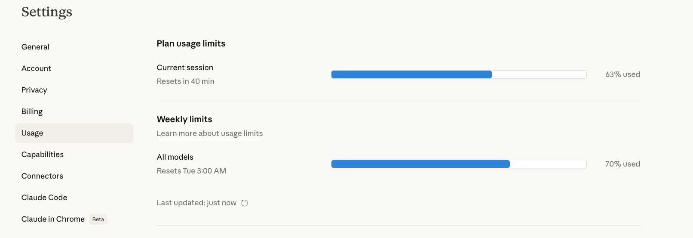
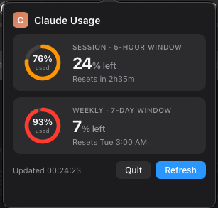

# Claude Ticker

[](https://github.com/bestori/claude-ticker/actions/workflows/lint.yml)

> [!WARNING]
> **Unofficial side project - not affiliated with or endorsed by Anthropic.**
> This uses [claude.ai](https://claude.ai)'s internal, undocumented API. It may break at any time.
> The app will show `Claude ⚠` if something changes on Anthropic's end.

---

## Install & Run

> [!IMPORTANT]
> **Pick your platform below. Do NOT mix the requirements files.**

### Windows

**Step 1 — Install dependencies**
```bat
pip install -r requirements-windows.txt
```

**Step 2 — Build the .exe**
```bat
pyinstaller app_windows.py --onefile --windowed --name ClaudeTicker
```

**Step 3 — Run it**
```bat
dist\ClaudeTicker.exe
```

The app appears in the **system tray** (bottom-right corner). Left-click the tray icon to show/hide the popup. Right-click → Quit.

> **Prerequisites:** Windows 10 or later · Python 3.11–3.13 (3.14 not yet supported — see [note](#python-version)) · WebView2 runtime (already installed on most Windows 10/11 machines — if missing, grab it from [Microsoft](https://developer.microsoft.com/en-us/microsoft-edge/webview2/)) · Chrome, Firefox, Brave, or Edge logged into [claude.ai](https://claude.ai)

> **Auto-start:** Drop a shortcut to `ClaudeTicker.exe` into `shell:startup`.

---

### macOS

**Step 1 — Install dependencies**
```bash
pip3 install -r requirements-macos.txt
```

**Step 2 — Build the .app**
```bash
./build.sh
```

**Step 3 — Install & run**
```bash
cp -r dist/ClaudeTicker.app /Applications/
open /Applications/ClaudeTicker.app
```

The app appears in the **menu bar**. Click it to open the popup.

> **First launch:** Right-click → Open (macOS Gatekeeper). After that, launch normally.  
> **Keychain prompt:** Allow it — this lets the app read your browser's session cookie.  
> **Auto-start:** System Settings → General → Login Items → `+` → pick `ClaudeTicker.app`.

> **Prerequisites:** macOS 13 Ventura or later (tested on macOS 15 Sequoia) · Python 3.11–3.13 (3.14 not yet supported — see [note](#python-version)) · Chrome, Firefox, Safari, Brave, or Edge logged into [claude.ai](https://claude.ai)

---

> **Both platforms require a [Claude.ai](https://claude.ai) paid plan** (Pro, Team, or Max — the free tier does not expose usage limits).

---

## Why do you need *yet another ticker*?

Another inevitable Claude session... and you suddenly hit a rate limit.  
Sounds familiar?...  
You know there are usage limits.  
What bugged me was that the only way to check how much runway I had left was to open a browser, navigate to **Settings → Usage**, and **read a progress bar**.

That page looks like this:



It's genuinely useful information - a 5-hour rolling session window and a 7-day weekly cap, both shown as percentages with reset times. But it lives buried in a settings page. I found myself checking it constantly, tabbing away from whatever I was doing, and then tabbing back.

So I thought: this is exactly the kind of thing a menu bar ticker is for. Bitcoin prices live up there. My internet speed lives up there. Why not my Claude usage?

Shortly after, I had a Python script scraping the page. Then - a proper macOS `.app` with a graphical popover. This is that app.

---

## What it does

A tiny item lives permanently in your menu bar (macOS) or system tray (Windows):


- `S:XX%` - how much of your **session** window is still available
- `W:XX%` - how much of your **weekly** limit is still available
- `XXm / XhXXm` - time until your current session resets

Click it and you get a proper graphical popup:



Two cards with animated SVG arc rings, one for each limit window. The rings fill clockwise and change colour as usage climbs:

| Usage | Ring colour |
|-------|------------|
| 0 – 59% | Green |
| 60 – 84% | Orange |
| 85 – 100% | Red |

Fully dark-mode aware. Refreshes every 120 seconds on its own, or on demand via the Refresh button. Use the **A− / A+** buttons to scale the popup to your taste.

**[PRs, issues, and contributions welcome!](https://github.com/bestori/claude-ticker)**

---

## How it actually works

No API key required. No Anthropic SDK. It does exactly what your browser does when you open that settings page - it reads your existing browser session cookie and makes the same internal API call the web UI makes.

The two calls it makes every refresh:

```
GET /api/bootstrap          → your org UUID
GET /api/organizations/{uuid}/usage  → the usage numbers
```

The response from that second call is what feeds the whole thing:

```json
{
  "five_hour": {
    "utilization": 63.0,
    "resets_at": "2026-03-29T18:00:00+00:00"
  },
  "seven_day": {
    "utilization": 70.0,
    "resets_at": "2026-04-01T00:00:00+00:00"
  }
}
```

The `utilization` is percent used. The `resets_at` gives the countdown.

On first launch, macOS will ask for **Keychain access** - that's the app asking permission to decrypt Chrome's stored cookies. Allow it. Nothing is stored or sent anywhere else.

---

## Browser configuration

Chrome by default. To use something else, create `~/.config/claude-ticker/config.json`:

```json
{ "browser": "firefox" }
```

Valid values: `chrome`, `chromium`, `brave`, `firefox`, `safari` (macOS only), `edge`.
Changes take effect on the next refresh - no restart needed.

---

## Running in dev mode (no build)

### macOS
```bash
python3 app.py
```

### Windows
```bat
python app_windows.py
```

To test just the data fetching on either platform:

```bash
python3 -c "
from scraper import fetch_usage, session_minutes_remaining, weekly_reset_local_str
d = fetch_usage()
print(f'Session: {d.session_pct_used:.0f}% used | resets in {session_minutes_remaining(d):.0f}m')
print(f'Weekly:  {d.weekly_pct_used:.0f}% used | resets {weekly_reset_local_str(d)}')
"
```

---

## Troubleshooting

| Symptom | Most likely cause | Fix |
|---------|------------------|-----|
| `Claude ⚠` in menu bar | Cookie expired or not logged in | Log out and back into [claude.ai](https://claude.ai) in Chrome |
| `Could not find org UUID` | `/api/bootstrap` changed | Run `python3 discover.py` |
| `Claude ⚠` after an Anthropic update | API endpoint or response shape changed | Run `python3 discover.py` and open an issue |
| Keychain prompt denied (macOS) | Denied on first run | System Settings → Privacy & Security → Keychain Access |
| Shows `…` forever | First fetch still in progress | Wait 30s; if stuck, quit and restart |
| Popup doesn't appear (Windows) | WebView2 not installed | Install [Microsoft Edge WebView2](https://developer.microsoft.com/en-us/microsoft-edge/webview2/) |
| `Could not decrypt cookies` (Windows) | Chrome profile locked or wrong crypto backend | Close Chrome fully, retry. Or switch to Firefox/Edge in config |
| Install errors mentioning `objc` or `AppKit` (Windows) | Wrong requirements file used | Run `pip install -r requirements-windows.txt` — never use `requirements-macos.txt` on Windows |
| `ModuleNotFoundError: No module named 'pystray'` | Wrong requirements file used | Run `pip install -r requirements-windows.txt` |

If the API has moved, `discover.py` will probe a list of candidate endpoints and show you exactly what comes back:

```bash
python3 discover.py
# or for a specific browser:
CLAUDE_TICKER_BROWSER=firefox python3 discover.py
```

---

## Project structure

```
claude-ticker/
├── app.py                macOS UI — NSStatusItem, NSPopover, WKWebView, NSTimer
├── app_windows.py        Windows UI — pystray tray icon, pywebview floating window
├── ui_shared.py          Shared HTML/CSS/JS popup + _fmt() helper (both platforms)
├── scraper.py            All HTTP — cookie extraction, API calls, reset arithmetic
├── config.py             Browser selection via ~/.config/claude-ticker/config.json
├── discover.py           One-shot endpoint probe (run when the scraper breaks)
├── setup.py              py2app bundle config (macOS)
├── build.sh              macOS build + sign in one step
├── requirements-macos.txt    macOS runtime deps  ← use this on macOS
├── requirements-windows.txt  Windows runtime deps ← use this on Windows
├── requirements-dev.txt  Test/lint deps (pytest, ruff)
├── pyproject.toml        Ruff + pytest config
├── tests/
│   ├── test_scraper.py   Unit tests for scraper.py (fully mocked)
│   └── test_config.py    Unit tests for config.py
└── .github/workflows/lint.yml  CI (ruff + pytest, macos-latest)
```

---

## Running the tests

No live Claude session needed - everything is mocked.

```bash
pip install -r requirements-dev.txt
pytest tests/ -v
```

---

## Under the hood

**Why PyObjC on macOS and not something like `rumps`?**
`rumps` wraps standard `NSMenu` dropdowns - text only. The graphical popover with arc rings needs `NSPopover` + `WKWebView`, which requires direct AppKit/WebKit bindings. PyObjC gives you the full Cocoa API from Python.

**Why pystray + pywebview on Windows?**
The popup HTML/CSS/JS is already a self-contained page — pywebview renders it in an Edge WebView2 window. pystray handles the system tray icon. Together they're a thin wrapper around the same UI, with no Electron or Node.js involved.

**How does the same HTML work on both platforms?**
The JS bridge uses a `_post()` function that detects the host at runtime: on macOS it routes through `window.webkit.messageHandlers`; on Windows through `window.pywebview.api`. The HTML lives in `ui_shared.py` and is imported by both `app.py` and `app_windows.py`.

**Thread model:**
The UI runs on the main thread (NSRunLoop on macOS, pywebview event loop on Windows). All network I/O happens on daemon background threads. A non-blocking `threading.Lock` prevents concurrent fetches.

---

## Python version

**Supported: Python 3.11, 3.12, 3.13.**

Python 3.14 is not yet supported. The blockers are packaging dependencies — `py2app` (macOS bundler) and `PyObjC` are slow to publish wheels for new Python releases. The project code itself has no 3.14 incompatibilities; once those packages ship 3.14 wheels this note will be removed.

Check your version: `python3 --version`

---

## Privacy

- Cookies are read locally from your browser's on-disk profile - no browser extension involved.
- They're used only to authenticate the two API calls per refresh cycle.
- Nothing is logged, stored, or sent anywhere else. No analytics, no telemetry.
